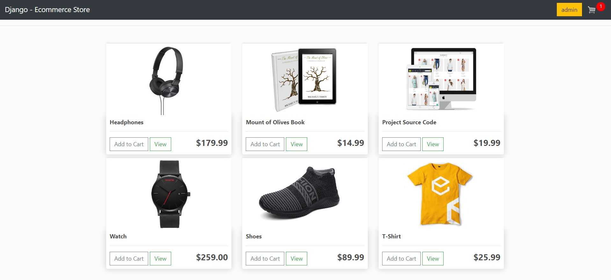
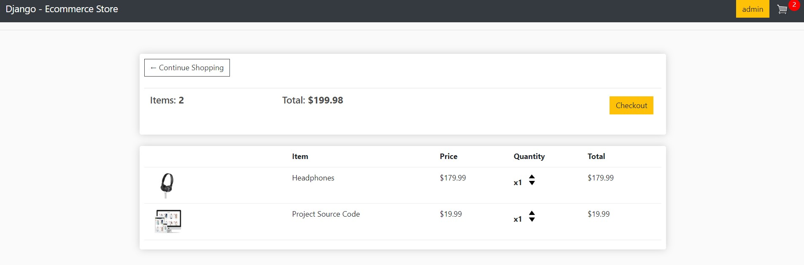
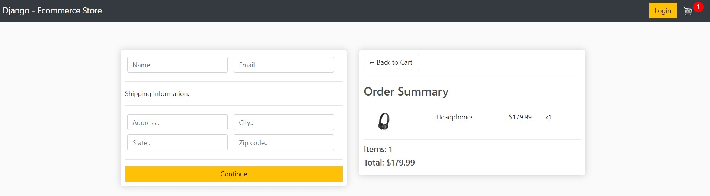
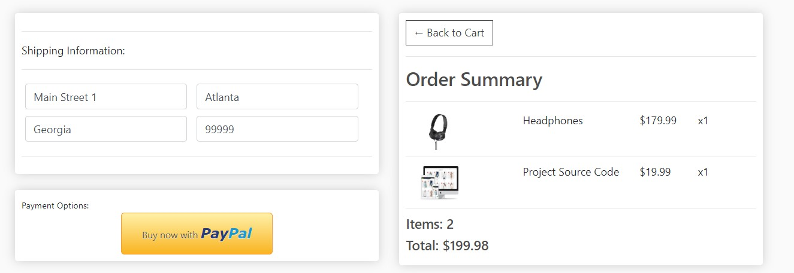
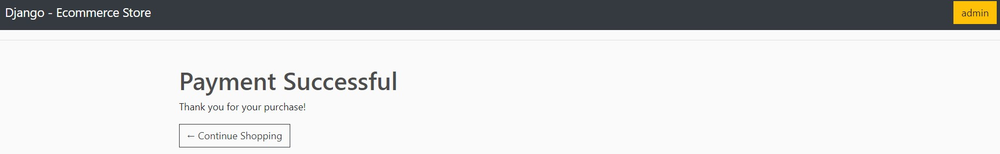
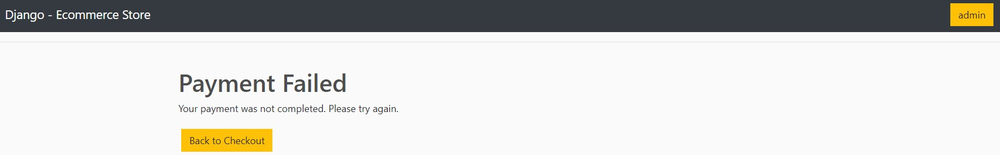

# Django Ecommerce Website
Fully functional Django-based ecommerce website with user and guest checkout capabilities.

Payments are processed via PayPal.

## Store

The user is able to add the products to their cart, which is displayed in the top right corner.

This also works with user who are not logged in by storing their cart within a cookie.

## Cart

The cart view displays the items that are currently within the users cart. It features the option to either increase or decrease the items quantity.

Quantities below 1 lead to the item being removed from the cart.

## Checkout

If the user is not logged, the user will be able to enter a name and an email adress.

Further, the shipping details have to be added, if at least one non-digital item is in the cart.

## Payment

After filling out the form and clicking on continue, the user is able to finish the purchase by payment via paypal.

After an successful payment, the order is set to complete within the Django back-end.

### Success

After an successful payment the user is directed to a success page.

### Failed

After an failed payment the user is directed to a 'payment failed' page.

# Sources
- [Dennis Ivy - Tutorial](https://www.youtube.com/playlist?list=PL-51WBLyFTg0omnamUjL1TCVov7yDTRng)
- [Django Paypal Payment Gateway Integration with Working Example
](https://studygyaan.com/django/django-paypal-payment-gateway-integration-tutorial)